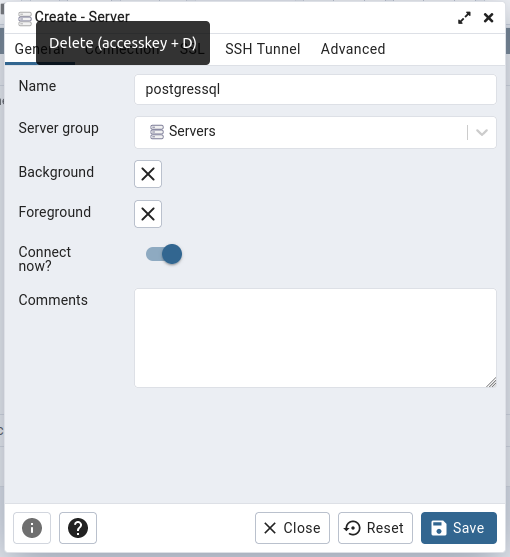
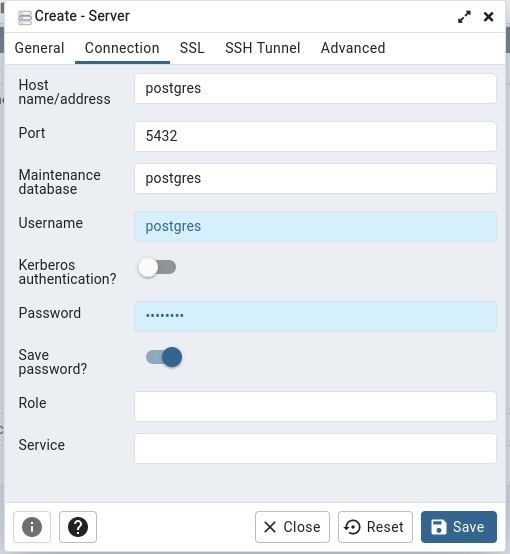

## Running postgres and pgadmin in a container

    docker-compose up

## Open PgAdmin web interface:

    http://localhost:5050
    Username: admin@test.com
    Password: admin

# Connecting to postgres server.

Create new server | Server config
:-------------------------:|:--------------------------------------------------:
  |  
